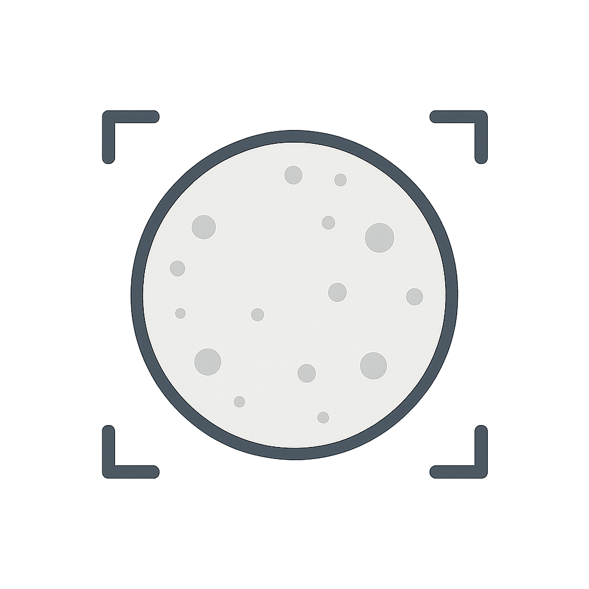

<div align="center">
  <h1>MoonLabel</h1>
  
  <p>An object-detection labelling tool.</p>
  <p><em>Powered by <a href="https://moondream.ai/">Moondream VLM</a></em></p>
</div>

---

## Overview

MoonLabel is a lightweight image-annotation tool that streamlines the process of generating training data for computer-vision models.

1. **Upload an image** and list the object classes you're interested in.
2. The backend queries the **Moondream VLM** to detect those objects and returns bounding-box coordinates.
3. The frontend overlays the boxes for quick visual review and lets you **export YOLO-format labels** (image + labels + data.yaml) in a single ZIP file.

This makes it easy to build datasets for object detection and other computer-vision research or application areas without setting up a heavy annotation pipeline.

## Demo

<p align="center">
  <video src="frontend/src/assets/demo.mp4" width="600" controls></video>
</p>

---

## Features

* 🌐 **API-driven backend** — FastAPI with automatic OpenAPI docs.
* ⚛️ **Modern frontend** — React 19, TypeScript, TailwindCSS, Vite.
* 🖼️ **Object detection** — Utilises the Moondream API and converts results to YOLO format.
* 🐳 **Docker-first** — Single-command build & run.

## Project Structure

```
moonlabel/
├── backend/      # FastAPI application & inference logic
│   ├── src/
│   └── requirements.txt
├── frontend/     # React + Vite SPA
│   ├── src/
│   └── public/
├── Dockerfile    # Multi-stage build (frontend → backend)
└── README.md
```

## Prerequisites

* **Docker** ≥ 20.10 _(recommended)_
* Otherwise: Node.js ≥ 20 & Python ≥ 3.11 if running without Docker.
* **Moondream API key** — Sign up for a free key following the [Moondream Quickstart](https://moondream.ai/c/docs/quickstart) guide. You'll enter this key on the app's **Settings** page.

## Quick Start with Docker

```bash
# Clone the repository
git clone https://github.com/muratcanlaloglu/moonlabel.git
cd moonlabel

# Build the image
docker build -t moonlabel .

# Run the container (frontend + API on port 8000)
docker run -p 8000:8000 moonlabel
```

Visit http://localhost:8000 to open the web UI.

## Local Development

### Backend

```bash
cd backend
python -m venv .venv
source .venv/bin/activate  # On Windows: .venv\Scripts\activate
pip install -r requirements.txt
uvicorn src.api:app --reload
```

### Frontend

```bash
cd frontend
npm install
npm run dev
```

The frontend dev server will proxy API requests to the backend at http://localhost:8000 by default.

---

## Roadmap / TODOs

Below are planned enhancements and upcoming features. Contributions welcome!

- [ ] **Local Moondream support** – Run inference locally via Moondream Station (Mac/Linux) or direct Hugging Face Transformers.
- [ ] **Batch uploads** – Label multiple images in one go, with progress tracking.
- [ ] **Additional export formats** – COCO JSON and Pascal VOC alongside YOLO.

---

## License

This project is licensed under the terms of the MIT license. See [LICENSE](LICENSE) for details.

